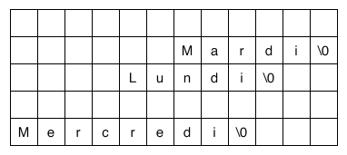

# Tableaux et pointeurs

Soit le contenu mémoire suivant :

1. Déclarez un tableau contenant le contenu de cette mémoire.
2. Déclarez ensuite un tableau de pointeurs vers ces trois chaînes de caractères
qui affichera les trois premiers jours de la semaine dans l'ordre.

Indications
-----------

La fonction *sprintf(char *str, char *format, ...) fonctionne comme printf()
mais écrit le résultat à l'adresse sockée dans *str*

Exemple :

~~~cpp

char s[80];
sprintf(s, "%s", "hello");

~~~

Solution

~~~cpp

#include <stdio.h>

int main(void) {

	char array[60];
	char *ptr;
	char *strs[3];
	int i;

	ptr = array;
	sprintf(ptr, "%s", "Mercredi");

    strs[2] = ptr;

	ptr += 28;
	sprintf(ptr, "%s", "Lundi");

	strs[0] = ptr;

	ptr = array + 42;
	sprintf(ptr, "%s", "Mardi");

	strs[1] = ptr;

	for (i = 0; i < 3; i++)
		printf("%s\n", strs[i]);

} 
 
~~~
 

